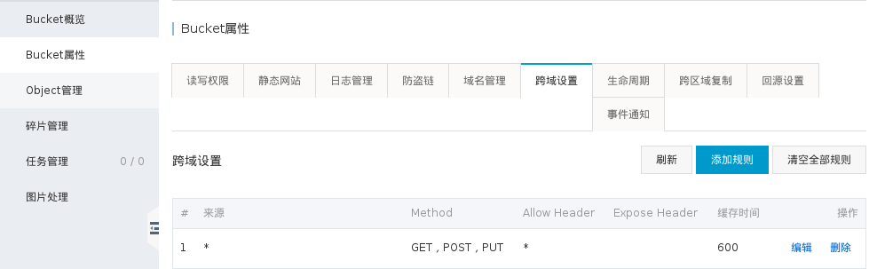

# oss-upload-nodejs
基于node.js和oss的单文件上传Demo。
**如何运行这个Demo？**
- 后端：backend目录

```
npm install
npm start
```

- 前端：webfront目录

```
npm install
npm run dev
```

## 单个图片上传页面，上传后显示图片预览


## 阿里云OSS服务端签名后直传
我们都知道，采用JS客户端直接签名，OSSAccessId和AccessKeySecret暴露在前端页面，可以被轻易获取，存在严重安全隐患。
这里提供了一种使用阿里云OSS服务器端签名后直传，避免这种危险的方法。由于阿里云OSS开发文档只提供了Java，PHP，Python和Go语言的例子，本Demo在此提供一个以Node.js作为后端的例子，供大家参考。
***
### 请求逻辑：
1. 客户端要上传图片时，到应用服务器取上传的policy及签名(signature)
2. 应用服务器返回上传policy和signature
3. 客户端拿到了签名后，直接上传到OSS

### 目前支持
chrome, firefox浏览器，其他浏览器还未全面测试，欢迎大家测试后在Issues里反馈。

## 使用
### 配置OSS
1. 进入阿里云管理控制台 --> 对象存储OSS
2. 新建Bucket
3. Bucket属性 --> 跨域设置：


### 查看自己的AccessKey


点击显示，会弹出短信验证窗口，验证后即可显示出你的AccessKeySecret

### 后端配置文件
```
backend/src/config/development/app.js

module.exports = {
  port: 3602,
  oss: {
    OSSAccessKeyId: '【这里填你阿里云的Access Key ID】',
    secret: '【这里填你阿里云的Access Key Secret】',
    host: 'http://cqq.oss-cn-shenzhen.aliyuncs.com' //改为你自己阿里云OSS的外网域名
  }
}

```
## 技术栈
- [koa](http://koajs.com/)
- [koa-router](https://github.com/alexmingoia/koa-router)
- [vue](http://cn.vuejs.org/)
- [vue-router](https://router.vuejs.org/)
- [axios](https://github.com/mzabriskie/axios)

## 欢迎Start，欢迎Pull Requests
